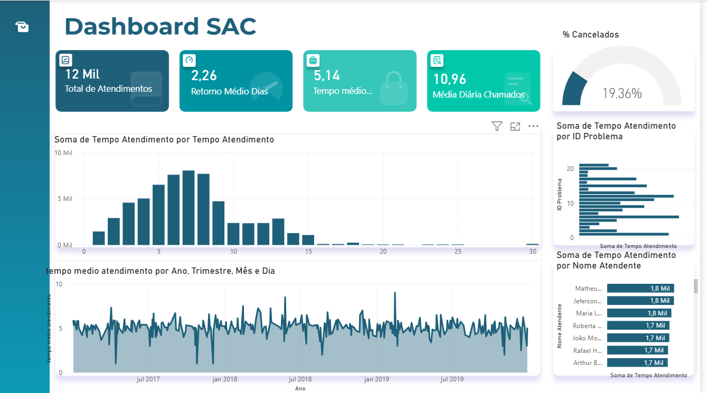
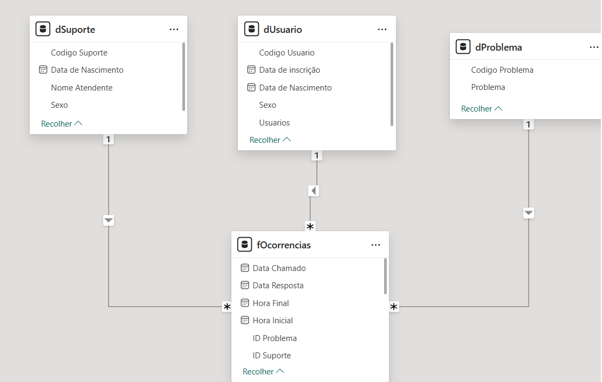

# analise-chamados-suporte-powerbi
# Análise de Chamados de Suporte - Power BI

## 📊 Sobre o Projeto

Este projeto consiste em um dashboard desenvolvido no Power BI para análise de chamados de suporte técnico, permitindo acompanhar indicadores de SLA, tempo médio de atendimento, volume de chamados e produtividade dos atendentes.

## 🛠 Ferramentas Utilizadas

* Power BI
* DAX
* Modelagem Dimensional (Star Schema)
* Excel
* GitHub

## 🧱 Modelagem de Dados

O projeto foi desenvolvido utilizando modelo dimensional (Star Schema), contendo:

* **fOcorrencias** (Tabela Fato)
* **dUsuario** (Dimensão)
* **dProblema** (Dimensão)
* **dSuporte** (Dimensão)

## 📈 Indicadores (KPIs)

* Total de Chamados
* Chamados Abertos
* Chamados Resolvidos
* Tempo Médio de Atendimento
* Média Diária de Chamados
* Chamados por Problema
* Chamados por Atendente

## 🖥 Dashboard

## ⭐ Modelo Estrela

## 📁 Arquivo Power BI

O arquivo .pbix está disponível na pasta **pbix** do repositório.

## Dashboard

## Modelo Estrela

